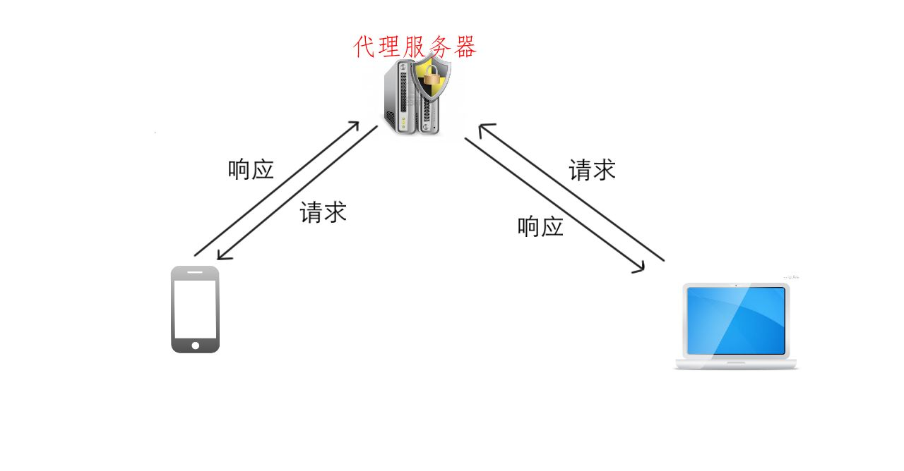
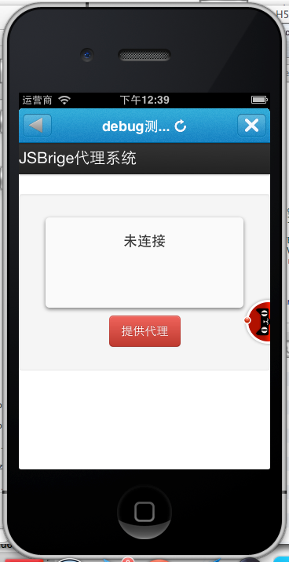
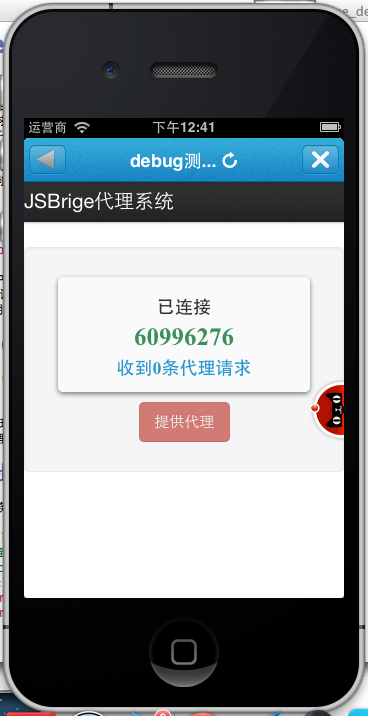
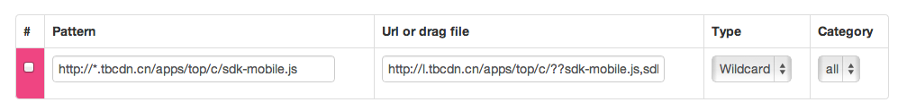
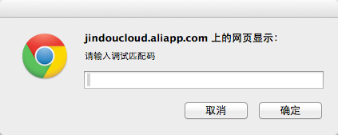
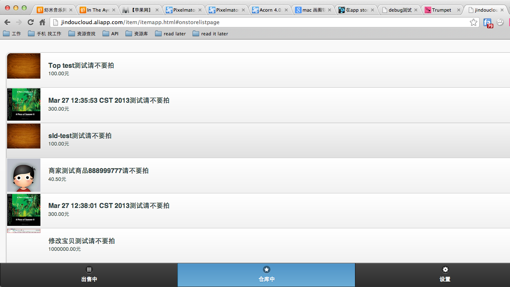
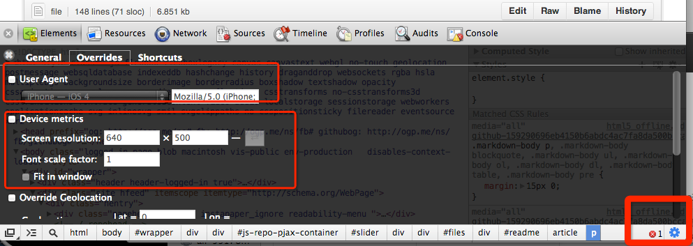
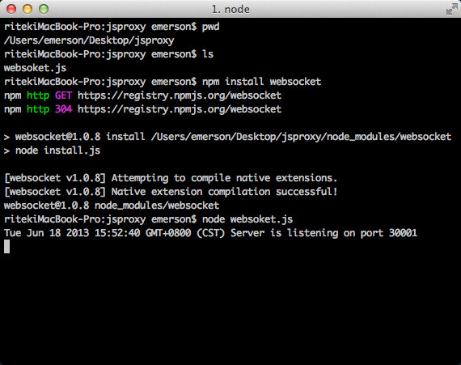
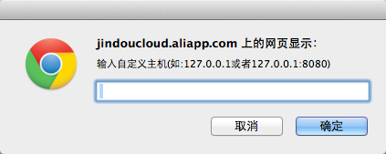

#JSBrige Debug手册#
##JSbrige 开发需要解决什么问题##

由于JS会和页面嵌入的容器打交道（跳转等）,所以在开发的时候强依赖于手机端的千牛容器。随着客户端请求API的JS开放,数据开始走JSBrige,而手机端容器非常难以开发调试,这就使得开发千牛退化到了最原始的方式alert;

本方案就是为了无缝解决对手机端容器强依赖的问题,让程序可以跑在chrome等桌面浏览器里,同时又不影响JS brige的native API请求的调用。

##JSBrige Debug方案的原理##

如上图所示：为了在PC上开发，需要一台手机代理真实的native api请求。原理大致是：当在PC浏览器里调用native的方法的时候，把调用native的请求转发到代理服务器上，然后通过代理服务器下发到某台手机上，执行完后，把结果再返回给PC

##实现debug的要求##

1. 一台代理服务器（我们已经提供）
2. 一台代理手机
3. 一台开发PC
4. 让PC的JS连到代理服务器上
5. 让手机连接到代理服务器上

##具体操作步骤##

###让手机连接到代理服务器上###

在插件的某个页面放置一个debug按钮，对开发用户可见，当用户点击debug按钮后，将插件页面跳转到：
	
	http://l.tbcdn.cn/apps/top/c/ui/proxy/proxy.html
	
该页面如下所示

**请保证手机端是永不锁屏的,否则连接很容易被断开**

###让PC连接到代理服务器上###
在PC上，通过[fiddler](http://fiddler2.com/) 
或者 [nproxy](http://blog.goddyzhao.me/post/35906061908/nproxy-fiddler-in-mac-and-linux) 
或者 [trumpet](https://chrome.google.com/webstore/detail/trumpet/cflekmkldaldnelemkkldoaedapbkmog) 将sdk-mobile.js代理掉，代理的地址是

	http://l.tbcdn.cn/apps/top/c/??sdk-mobile.js,sdk-mobile-debug.js
	
笔者使用的是trumpet，一个chrome插件，安装完成后按照上面的要求，配置一条规则：

这个时候，在PC上请求插件地址：如

	http://jindoucloud.aliapp.com/item/item.html?plugInType=shangpinguanli&uid=89286706&event=event_go_plugin&authString={***有码****}&

插件页面会主动弹出一个输入框（代理JS弹出的,无需惊慌）,在输入框内，输入手机端连接时的8位数字匹配码

输入成功后,就可以开始调试啦。

##注意事项##

**PC端连接时，相匹配的手机端必须已连接上，否则会直接断开**

**手机端一旦断开，PC端立马会断开**

**请保证手机端是永不锁屏的，否则一旦锁屏会立马被操作系统断开**

##Chrome伪装成手机##
判断是否是手机还是电脑一般都是通过设备高宽和UA来判断。chrome提供伪装机制，
打开chrome的web调试工具：

##高级进阶##
###自己部署代理服务器###
我的网络很差，如何自己部署代理服务器。其实也很简单。
首先你需要安装[nodejs](http://nodejs.org/).

（因为我们的proxy程序是基于nodejs跑的，所以需要先安装nodejs）

然后下载[proxy程序](proxy.zip)

解压后cd 到当前解压文件下，执行以下命令
	
	npm install websocket
	node websoket.js
	

代理服务器已经起来了，那接下来我们需要：

1、让手机连接到自定义的代理服务器上
在proxy页面后，加上hash，如：

	http://l.tbcdn.cn/apps/top/c/ui/proxy/proxy.html#host=127.0.0.1
	
2、让chrome连接到自定义代理服务器
将代理JS改成:

	http://l.tbcdn.cn/apps/top/c/??sdk-mobile.js,sdk-mobile-config-debug.js,sdk-mobile-debug.js

	
恭喜你，大功告成！

